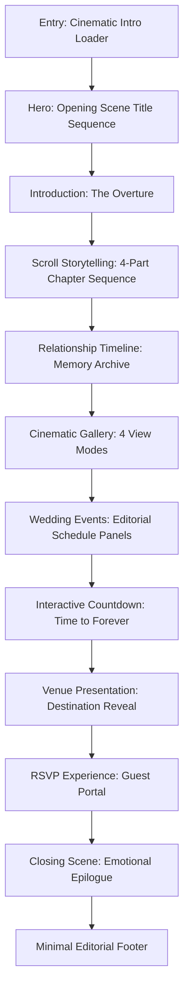

# Cinematic Wedding Website: Single Source of Truth Specification (`requirement.md`)

> **Document Type:** Production Engineering & Creative Architecture Specification  
> **Target Experience:** Award-Winning Interactive Wedding Film / Luxury Editorial Love Story  
> **Primary Design Reference:** [`websiteReference.png`](file:///E:/ME/cinematicwedding/websiteReference.png)  
> **Version:** 1.0.0-PROD  
> **Status:** Approved for Implementation

---

## 1. Project Vision

The objective of this project is to construct an immersive, award-winning interactive wedding experience that blurs the line between a digital love story, fine-art cinema opening sequence, and high-fashion luxury editorial magazine. 

This website **must not** resemble or behave like a conventional, template-driven wedding invitation site (i.e. no generic pastel floral cards, no bootstrap/dashboard widgets, no stock countdown tickers, no floating confetti scripts, and no generic RSVP forms). Instead, the platform is designed as an **interactive film** where the visitor transitions from passive observer to active witness of the couple’s narrative.

### Key Experiential Attributes
* **Cinematic Pacing:** Every viewport acts as a deliberate scene with slow zooms, atmospheric depth, and controlled editorial reveals.
* **Fine-Art Editorial Elegance:** Meticulous typographic tracking, generous negative space, sophisticated muted palettes, and timeless composition.
* **Atmospheric Polish:** Subtle analog film grain, directional light leaks, dust particle physics, gentle vignette depth, and bespoke ambient audio.
* **Interactive Storytelling:** Scroll-driven camera parallax, multi-layer scene depth (Background / Midground / Foreground), and choreographed image mask transitions.
* **Zero UI Friction:** Responsive tactile micro-interactions (magnetic anchors, context-aware cursor physics, audio waveforms) that enhance without obstructing clarity.

---

## 2. Design Philosophy

1. **"Entering a Story, Not Browsing a Site"**  
   The site follows an uncompromising filmic arc: *Open $\rightarrow$ Discover $\rightarrow$ Remember $\rightarrow$ Experience $\rightarrow$ Celebrate $\rightarrow$ Countdown $\rightarrow$ Arrive $\rightarrow$ RSVP*.
2. **Function-Driven Luxury & Frictionless Storytelling**  
   Beauty and emotion reinforce narrative clarity. Information (dates, times, venues, dress codes, RSVP) is seamlessly woven into the visual rhythm.
3. **Restraint Over Excess ("Less, But Better")**  
   Every animation, letterform, and particle effect must earn its place on screen. No random decorative fluff or gimmicky 3D clutter.
4. **Cinematic Physics**  
   Animations follow realistic camera dynamics: inertial dampening, optical zoom simulation, soft ease curves (`cubic-bezier(0.22, 1, 0.36, 1)`), and smooth alpha crossfades.
5. **Universal Accessibility & Graceful Degradation**  
   The cinematic romance must communicate flawlessly across screen readers, touchscreens, high-end 4K monitors, low-end mobile devices, and reduced-motion user environments.

---

## 3. Target Experience

| Dimensional Axis | Desired Visitor Emotion & Perception | Forbidden Anti-Patterns |
| :--- | :--- | :--- |
| **Visual Tone** | Intimate, timeless, dark-mode luxury, editorial haute-couture | Neon accents, flat white cards, purple gradients, clipart |
| **Motion Feel** | Smooth camera moves, slow push-ins, filmic curtain unmasks | Jerky transitions, bouncing icons, intrusive auto-popups |
| **Typography** | Editorial display serifs with generous tracking and crisp metadata | Unstyled sans-serif, comic scripts, oversized untracked headers |
| **Audio Space** | Warm, evocative, subtle cello/piano ambient landscape with toggle | Obnoxious autoplay blast, looping chimes, unmutable audio |
| **Mobile Experience** | Dedicated vertical cinematic storybook with tactile gestures | Shrunk desktop views, squished photos, clipped text, hover bugs |

---

## 4. Visual Direction

Inspired by high-end cinema title sequences (e.g., Denis Villeneuve, Wong Kar-wai), luxury heritage publications (*Vogue*, *Kinfolk*, *Cereal*), and world-class resort digital experiences (Aman, Belmond, Rosewood).

* **Atmospheric Density:** Warm dark-tone canvas layered with subtle luminance, soft golden photographic highlights, deep charcoal shadows, and fine film grain.
* **Editorial Composition:** Asymmetrical grid arrangements, intentional negative space, high-contrast serif typography contrasted with delicate monospaced or tracking-expanded sans-serif metadata.
* **Cinematic Framing:** 16:9 and 4:5 aspect ratios, wide landscape panoramas, intimate candid close-ups, and letterbox-inspired cinematic dividers.

---

## 5. Color System

Directly derived and extended from the primary visual reference board [`websiteReference.png`](file:///E:/ME/cinematicwedding/websiteReference.png):

```
#080B0D (Near Black) ── #1A1A1D (Charcoal) ── #7A6A4D (Muted Bronze) ── #D7C6A5 (Champagne Gold) ── #EAD9B2 (Warm Ivory) ── #E9AD9B (Soft Rose Ochre)
```

```css
:root {
  /* Surface Tokens */
  --bg-primary: #080B0D;              /* Deep cinematic pitch black */
  --bg-secondary: #121518;            /* Elevated dark charcoal surface */
  --bg-surface: #1A1A1D;              /* Card & panel background */
  --bg-surface-elevated: #242429;     /* Hover & modal surface */
  --bg-overlay-dark: rgba(8, 11, 13, 0.78);
  --bg-overlay-heavy: rgba(8, 11, 13, 0.92);

  /* Typography Tokens */
  --text-primary: #F4EFE6;            /* Warm editorial ivory */
  --text-secondary: #D7C6A5;          /* Warm champagne gold */
  --text-muted: #8E887E;              /* Subdued warm stone gray */
  --text-dim: #54514B;                /* Footnotes & inactive indices */
  --text-accent: #EAD9B2;             /* High-luminance gold highlight */

  /* Accent & Metallic Tokens */
  --accent-gold: #D7C6A5;             /* Primary metallic tone */
  --accent-gold-hover: #EFE2C8;       /* Interactive gold glow */
  --accent-bronze: #7A6A4D;           /* Deep muted bronze border/divider */
  --accent-warm-rose: #E9AD9B;        /* Soft emotional accent */
  --accent-gold-rgb: 215, 198, 165;

  /* Border & Line Tokens */
  --border-subtle: rgba(215, 198, 165, 0.12);
  --border-medium: rgba(215, 198, 165, 0.28);
  --border-strong: rgba(215, 198, 165, 0.55);
  --divider-line: rgba(122, 106, 77, 0.35);

  /* FX & Overlays */
  --film-grain-opacity: 0.045;
  --vignette-strength: 0.45;
  --shadow-cinematic: 0 24px 48px -12px rgba(0, 0, 0, 0.85);
  --glow-gold-subtle: 0 0 24px rgba(215, 198, 165, 0.15);
}
```

---

## 6. Typography System

### 6.1 Font Stacks
1. **Display Serif:** `Cormorant Garamond` / `Cinzel Decorative` / `Playfair Display` (Fallback: `Didot`, `Bodoni MT`, `serif`)
   * *Role:* Hero titles, couple names, major scene headlines, dramatic quote statements, chapter numbers.
2. **Elegant Editorial Sans:** `Montserrat` / `Inter` / `Plus Jakarta Sans` (Fallback: `-apple-system`, `sans-serif`)
   * *Role:* Navigation, labels, dates, schedule metadata, body copy, form inputs, buttons.
3. **Accent Script (Restrained usage):** `Pinyon Script` / `Italianno` / `Alex Brush` (Fallback: `cursive`)
   * *Role:* Signature tagline (*"Forever starts here"*), intimate decorative whispers, wedding seal initials.

### 6.2 Scale & Hierarchy

| Token | Family | Weight | Size (Desktop) | Size (Mobile) | Line Height | Letter Spacing | Case |
| :--- | :--- | :--- | :--- | :--- | :--- | :--- | :--- |
| `--font-display-hero` | Display Serif | 300 | 5.5rem (88px) | 3.25rem (52px) | 1.05 | 0.18em | Uppercase |
| `--font-display-title`| Display Serif | 400 | 3.5rem (56px) | 2.25rem (36px) | 1.15 | 0.14em | Uppercase |
| `--font-display-sub`  | Display Serif | 300 | 2.0rem (32px) | 1.5rem (24px) | 1.30 | 0.10em | Uppercase |
| `--font-script-quote` | Accent Script | 400 | 2.75rem (44px) | 2.0rem (32px) | 1.20 | 0.02em | Normal |
| `--font-editorial-body`| Editorial Sans | 300 | 1.05rem (17px) | 0.95rem (15px) | 1.75 | 0.04em | Normal |
| `--font-meta-label`   | Editorial Sans | 500 | 0.75rem (12px) | 0.70rem (11px) | 1.40 | 0.25em | Uppercase |
| `--font-countdown-num`| Display Serif | 300 | 4.5rem (72px) | 2.75rem (44px) | 1.00 | 0.08em | Normal |
| `--font-button`       | Editorial Sans | 500 | 0.85rem (13.5px)| 0.80rem (13px) | 1.00 | 0.22em | Uppercase |

---

## 7. Content Architecture

All website data must be strictly decoupled from layout components into structured data files (`src/data/weddingContent.ts`):

```typescript
export interface WeddingConfig {
  couple: {
    partner1: { firstName: string; lastName: string; role: string };
    partner2: { firstName: string; lastName: string; role: string };
    monogram: string; // e.g. "A · M"
    tagline: string;  // e.g. "FOREVER STARTS HERE"
  };
  weddingDate: {
    isoString: string; // "2026-12-18T11:30:00+05:30"
    displayDate: string; // "18.12.2026"
    displayFull: string; // "DECEMBER 18, 2026"
  };
  audio: {
    title: string;
    artist: string;
    src: string;
    defaultVolume: number;
  };
  hero: {
    imageDesktop: string;
    imageMobile: string;
    cinematicVideoOverlay?: string;
    quote: string;
  };
  storyScenes: Array<{
    sceneNumber: string; // "01", "02", etc.
    headline: string;
    subtext: string;
    image: string;
    alignment: "left" | "right" | "center";
  }>;
  timelineMilestones: Array<{
    year: string;
    title: string;
    description: string;
    image: string;
  }>;
  gallery: Array<{
    id: string;
    src: string;
    caption: string;
    orientation: "portrait" | "landscape" | "editorial-square";
    category: "candid" | "ceremony" | "portraits" | "details";
  }>;
  events: Array<{
    id: string;
    name: string;
    date: string;
    time: string;
    venueName: string;
    venueAddress: string;
    description: string;
    dressCode?: string;
    iconSvg: string;
    image?: string;
    calendarLink: string;
  }>;
  venue: {
    name: string;
    palace: string;
    cityState: string;
    description: string;
    googleMapsUrl: string;
    coordinates: { lat: number; lng: number };
    image: string;
    travelNotes: string[];
  };
  rsvp: {
    deadlineDate: string;
    maxGuestsPerParty: number;
    dietaryOptions: string[];
    eventsList: string[];
  };
}
```

---

## 8. Information Architecture



---

## 9. Complete Page Flow

The visual narrative is composed of 12 contiguous scenes designed to be traversed smoothly via scroll or keyboard navigation:

1. **Scene 00 — The Prologue (Cinematic Loader)**
2. **Scene 01 — The Title Sequence (Hero)**
3. **Scene 02 — The Premise (Introduction & Monogram Reveal)**
4. **Scene 03 — The Narrative (Scroll-Driven Chapter Progression)**
5. **Scene 04 — The Memory Reel (Chronological Journey Timeline)**
6. **Scene 05 — The Visual Archive (Cinematic Multi-Mode Gallery)**
7. **Scene 06 — The Celebrations (Wedding Ceremonies & Events)**
8. **Scene 07 — The Anticipation (Live Precision Countdown)**
9. **Scene 08 — The Destination (Venue Showcase & Travel Info)**
10. **Scene 09 — The Confirmation (Interactive Editorial RSVP)**
11. **Scene 10 — The Epilogue (Emotional Closing Scene)**
12. **Scene 11 — The Credits (Minimalist Colophon & Footer)**

---

## 10. Cinematic Loader / Intro

As showcased in Reference Panel 1 (`websiteReference.png`):

```
┌──────────────────────────────────────────────────────────┐
│                                                          │
│                      ✦  ✦      ✦                         │
│                    A   ♥   M                             │
│                      ───────                             │
│                    18 . 12 . 2026                        │
│                                                          │
│              A STORY WORTH REMEMBERING                   │
│                                                          │
└──────────────────────────────────────────────────────────┘
```

### Behavior & Motion Choreography
1. **Initial State (0.0s – 0.4s):** Screen is absolute pitch black (`--bg-primary`). Subtle film grain layer initialized. Ambient particles begin subtle floating Brownian motion.
2. **Step 1 (0.4s – 1.4s):** Particle field intensifies slightly with soft golden luminance.
3. **Step 2 (1.2s – 2.2s):** Monogram letters (`A` and `M`) split-fade with tracking expansion (`letter-spacing: 0.1em` to `0.35em`). Soft gold heart glyph reveals between initials.
4. **Step 3 (2.0s – 2.8s):** Delicate horizontal line (`--accent-bronze`) expands outward from center from width `0%` to `80px`.
5. **Step 4 (2.6s – 3.6s):** Wedding date `18 . 12 . 2026` fades up with character stagger.
6. **Step 5 (3.2s – 4.2s):** Sub-tagline `"A STORY WORTH REMEMBERING"` reveals at `0.25em` tracking with low opacity (`0.75`).
7. **Exit Curtain (4.2s – 5.0s):** Loader splits into dual vertical curtains (or smooth cinematic iris fade), revealing the Hero photograph in full resolution behind it.
8. **Skip Mechanism:** Any click/tap or keypress (`Escape`, `Space`, `Enter`) immediately triggers the 0.5s accelerated exit transition. Returning visitors (detected via `sessionStorage`) trigger an ultra-swift 0.8s streamlined reveal.

---

## 11. Hero / Opening Scene

As showcased in Reference Panel 2 (`websiteReference.png`):

```
┌──────────────────────────────────────────────────────────┐
│ [ CINEMATIC COUPLE FULL-BLEED PHOTOGRAPH WITH SLOW ZOOM ]│
│                                                          │
│                     A R J U N                            │
│                         &                                │
│                     M E E R A                            │
│                                                          │
│                    18 . 12 . 2026                        │
│                                                          │
│                 FOREVER STARTS HERE                      │
│                                                          │
│                          │                               │
│                      ( SCROLL )                          │
└──────────────────────────────────────────────────────────┘
```

### Specifications
* **Visual Presentation:** 100vh / 100dvh full viewport coverage. Hero couple portrait featuring dark warm grading, soft backlight, and vignette edges.
* **Camera Movement:** Continuous subtle Ken Burns slow push-in (`scale: 1.0` $\rightarrow$ `1.08` over 12s, linear loop or scroll-scrubbed).
* **Parallax Layering:**
  * Background couple photography: Parallax speed $0.2\times$
  * Main Headline Typography: Parallax speed $0.6\times$
  * Foreground subtle particle/light dust overlay: Parallax speed $1.1\times$
* **Interactive Scroll Prompt:** Minimalist vertical line with pulsating animated dash moving downward towards the story chapter.

---

## 12. Scroll Storytelling System

As showcased in Reference Panel 3 (`websiteReference.png`):

```
┌──────────────┬──────────────┬──────────────┬──────────────┐
│ 01           │ 02           │ 03           │ 04           │
│              │              │              │              │
│ IT STARTED   │ ONE          │ A            │ AND SOMEHOW, │
│ WITH A       │ UNEXPECTED   │ CONVERSATION │ EVERYTHING   │
│ MOMENT.      │ MEETING.     │ THAT LASTED  │ CHANGED.     │
│              │              │ LONGER THAN  │              │
│              │              │ EXPECTED.    │              │
└──────────────┴──────────────┴──────────────┴──────────────┘
```

### Pinned Multi-Scene Experience
* **Pinned Scroll-Section:** Uses GSAP ScrollTrigger pinning across a 400vh virtual scroll container (or dynamic step-snap sequence).
* **The 4 Film Chapters:**
  1. **Scene 01:** *"It started with a moment."* — Intimate close-up (hands holding/silhouettes).
  2. **Scene 02:** *"One unexpected meeting."* — Atmospheric outdoor landscape scene.
  3. **Scene 03:** *"A conversation that lasted longer than expected."* — Warm candlelight dinner/evening ambiance.
  4. **Scene 04:** *"And somehow, everything changed."* — Wide cinematic portrait of the couple.
* **Choreographed Behavior:** As user scrolls, the active panel unmasks with a synchronized zoom and blur-to-sharp transition, the scene index (`01` $\rightarrow$ `04`) shifts with active underline illumination, and narrative text fades smoothly with letter-spacing dilation.
* **Input Neutrality:** Supports native wheel, trackpad inertial scrolling, mobile swipe gestures, and keyboard arrow keys without sticky lock trapping.

---

## 13. Relationship Timeline (Memory Archive)

As showcased in Reference Panel 5 (`websiteReference.png`):

```
  2019            2020            2021            2023            2025            2026
First Meeting   First Date    Our First Trip  The Proposal    Forever Begins   Our Wedding
  ────●───────────●───────────────●───────────────●───────────────●───────────────●────
 [ Photo 1 ]     [ Photo 2 ]     [ Photo 3 ]     [ Photo 4 ]     [ Photo 5 ]     [ Ring Box ]
```

### Desktop & Mobile Behavior
* **Desktop (Horizontal Film-Reel):** A continuous horizontal timeline tracking left-to-right. An illuminated progress line follows the active milestone. Each point expands an editorial photo frame on hover/scroll focus with year stamp, location metadata, and an intimate 2-sentence story snippet.
* **Mobile (Vertical Film-Strip):** Automatically transforms into an alternating vertical editorial timeline with an animated vertical gold trail.
* **Milestone Items:**
  1. `2019` — First Meeting
  2. `2020` — First Date
  3. `2021` — Our First Trip
  4. `2023` — The Proposal (Featuring ring/mountain imagery)
  5. `2025` — Forever Begins
  6. `2026` — Our Wedding (Grand culmination)

---

## 14. Cinematic Gallery

As showcased in Reference Panel 6 (`websiteReference.png`), supporting 4 distinct editorial presentation modes:

```
┌─────────────────────────┬─────────────────────────┐
│ A. FULLSCREEN TRANSITION│ B. STACKED IMAGES       │
│ Full-bleed cinematic    │ Layered physical prints │
│ photo with cross-wipe   │ with organic rotation   │
├─────────────────────────┼─────────────────────────┤
│ C. HORIZONTAL FILMSTRIP │ D. EDITORIAL LAYOUT     │
│ Drag/scroll film reel   │ Asymmetric magazine     │
│ with progress track     │ composition with quotes │
└─────────────────────────┴─────────────────────────┘
```

1. **Mode A — Fullscreen Film Transition:** Deep immersion full-viewport view with slow dissolve and optical crossfade.
2. **Mode B — Tactile Stacked Prints:** Overlapping vintage photo cards that shuffle and fan out dynamically based on cursor movement or swipe velocity (`tilt: -4deg` to `+6deg`).
3. **Mode C — Horizontal Drag Filmstrip:** Continuous panoramic strip with smooth touch drag, inertia momentum, and interactive progress scrubber.
4. **Mode D — Editorial Magazine Grid:** Asymmetrical multi-scale layout with integrated editorial captions, gold quotation marks, and varying aspect ratios (1:1, 4:5, 16:9).
5. **Interactive Lightbox:** Clicking any photo opens a dark-room high-resolution lightbox with metadata, photographer notes, and smooth keyboard navigation (`ArrowLeft`, `ArrowRight`, `Esc`).

---

## 15. Image Reveal System

As showcased in Reference Panel 7 (`websiteReference.png`):

| Reveal Type | Visual Description | Implementation Method | Ideal Section Pairing |
| :--- | :--- | :--- | :--- |
| **Curtain Reveal** | Dark overlay panel slides vertically or horizontally away | CSS `clip-path` / GSAP `yPercent: -100` | Section entrance headers |
| **Circle Reveal** | Iris circular mask expands outward from focal subject | `clip-path: circle(0% at 50% 50%)` $\rightarrow$ `circle(100%)` | Venue & Proposal photos |
| **Split Reveal** | Dual panels open horizontally from center seam | Dual child container translation `translateX(±100%)` | Wedding Events cards |
| **Diagonal Reveal** | Dynamic 45-degree angle polygonal slice unmask | `clip-path: polygon(0 0, 100% 0, 100% 100%, 0 100%)` | Gallery Mode transitions |
| **Blur-to-Sharp** | Photographic lens focus simulation (18px blur to 0px) | `filter: blur(18px) brightness(0.7)` $\rightarrow$ `blur(0px) brightness(1)` | Hero & Scene milestones |

---

## 16. Parallax / Layered Cinematic Scenes

As showcased in Reference Panel 8 (`websiteReference.png`):

```
┌──────────────────────────────────────────────────────────┐
│ BACKGROUND (Slow: 0.15x)   ─ Mountain peaks & soft mist  │
│ MIDGROUND  (Medium: 0.50x) ─ Couple embracing on cliff   │
│ FOREGROUND (Fast: 1.15x)   ─ Pine branches & dark stone  │
│ OVERLAY    (Fixed: 0.00x)  ─ Film grain & atmospheric dust│
└──────────────────────────────────────────────────────────┘
```

* **Depth Calculation:** Transforms use GPU-accelerated `translate3d(0, y, 0)` tied to scroll velocity.
* **Performance Safeguard:** Parallax calculation is debounced with `requestAnimationFrame` and disabled automatically on touch devices or under battery-saver mode.

---

## 17. Wedding Events

As showcased in Reference Panel 9 (`websiteReference.png`):

```
┌──────────────┬──────────────┬──────────────┬──────────────┬──────────────┐
│    HALDI     │   MEHENDI    │   SANGEET    │   WEDDING    │  RECEPTION   │
│              │              │              │              │              │
│ 20 DEC 2026  │ 20 DEC 2026  │ 21 DEC 2026  │ 22 DEC 2026  │ 22 DEC 2026  │
│   10:00 AM   │   04:00 PM   │   07:00 PM   │   11:30 AM   │   07:30 PM   │
│              │              │              │              │              │
│ Palace Lawn  │ Courtyard    │ Grand Ballroom│ Sacred Mandap│ Royal Hall  │
│              │              │              │              │              │
│ [Add Cal ▾]  │ [Add Cal ▾]  │ [Add Cal ▾]  │ [Add Cal ▾]  │ [Add Cal ▾]  │
└──────────────┴──────────────┴──────────────┴──────────────┴──────────────┘
```

### Event Panel Specifications
* **Visual Styling:** Luxury invitation cards crafted with `--border-subtle`, dark charcoal background, refined gold monogram icons, and hover border highlight.
* **Interaction:** Hovering an event card smoothly reveals an ambient blurred background photograph of the venue/ceremony and expands dress code details.
* **Calendar Integration:** One-click `.ics` export and direct links for Google Calendar, Apple Calendar, and Outlook.

---

## 18. Precision Countdown

As showcased in Reference Panel 10 (`websiteReference.png`):

```
                      F O R E V E R   B E G I N S   I N
             ─────────────────────────────────────────────────
                  12     :     04     :     20     :     35
                 DAYS        HOURS        MINUTES       SECONDS
```

### Functional Requirements
* **Accurate Tick Engine:** Uses UTC timestamps with local timezone auto-detection to prevent client clock skew.
* **Numeric Animation:** Smooth split-flap or vertical digit slide animation on number change.
* **State Machine:**
  * `T-Minus`: Displays live ticking countdown.
  * `Wedding Day`: Displays *"TODAY WE CELEBRATE OUR FOREVER"* with live event progress badge.
  * `Post-Wedding`: Displays *"HAPPILY EVER AFTER • THANK YOU FOR BEING PART OF OUR STORY"*.

---

## 19. Cinematic Venue Showcase

As showcased in Reference Panel 11 (`websiteReference.png`):

```
┌───────────────────────────────────────────────────┬──────────────────────┐
│                                                   │   THE GRAND          │
│                                                   │   TAJ PALACE         │
│   [ HIGH RESOLUTION DUSK PHOTOGRAPH               │                      │
│     OF PALACE OVERLOKING WATER ]                  │   UDAIPUR, RAJASTHAN │
│                                                   │                      │
│                                                   │   A timeless place   │
│                                                   │   for a timeless     │
│                                                   │   celebration.       │
│                                                   │                      │
│                                                   │   [ VIEW LOCATION →] │
└───────────────────────────────────────────────────┴──────────────────────┘
```

* **Interactive Elements:**
  * High-resolution illuminated architectural photography with slow zoom.
  * Interactive map toggle (Styled Dark-Mode Mapbox/Google Maps integration with customized champagne gold pins).
  * Direct "Get Directions" navigation launcher and Airport / Transport guidance accordion.

---

## 20. RSVP Experience

An integrated, luxury guest portal that preserves the cinematic mood:

### Form Architecture
1. **Step 1 — Guest Identification:** Primary guest name & companion lookup.
2. **Step 2 — Attendance Declaration:** Attending (Joyfully Accepts) / Not Attending (Regretfully Declines).
3. **Step 3 — Ceremony Participation:** Multi-select checkboxes for individual events (Haldi, Mehendi, Sangeet, Wedding, Reception).
4. **Step 4 — Preferences & Notes:** Dietary constraints (Vegetarian, Vegan, Gluten-Free, Allergies) and personal message to the couple.
5. **Step 5 — Submission & Confirmation:** Real-time optimistic UI validation, smooth loading pulse, followed by an elegant golden wax-seal confirmation animation.

---

## 21. Navigation System

* **Header Navigation:** Minimalist glassmorphism top bar (`backdrop-filter: blur(12px)`); remains completely hidden on initial hero scene and smoothly slides down when user scrolls past 30% of viewport height.
* **Links:** `OUR STORY` · `TIMELINE` · `GALLERY` · `EVENTS` · `VENUE` · `RSVP`.
* **Mobile Drawer:** Fullscreen dark editorial overlay with oversized display serif links and staggered entrance physics.

---

## 22. Music & Sound Experience

As showcased in Reference Panel 17 (`websiteReference.png`):

```
┌──────────────────────────────────────────────────────────┐
│ Ambient soundtrack  ──  ılılıllıılılılllılı  ──  [ ▶ / ⏸ ] │
└──────────────────────────────────────────────────────────┘
```

* **Audio Policy Compliance:** Never violates browser autoplay restrictions. Audio starts only upon explicit visitor activation or voluntary unmute click on intro loader.
* **Audio Element:** High-fidelity ambient instrumental (acoustic cello/soft piano).
* **Waveform UI:** Live interactive Canvas/SVG audio visualizer responding to playback frequency or smooth CSS waveform equalizer animation.
* **Volume Fade Dynamics:** Smooth 1.5s volume fade-in on play and 1.0s fade-out on pause or tab visibility loss (`visibilitychange` API).

---

## 23. Custom Cursor Experience

As showcased in Reference Panel 18 (`websiteReference.png`):

```
  DEFAULT          VIEW           DRAG           OPEN           RSVP
    ( · )         ( 👁 )          ( ↔ )          ( ⤢ )         ( RSVP )
  Small dot     Expanded       Directional    Interactive     Pill with
  with trail      circle         arrows         crosshair      gold label
```

* **Desktop Exclusive:** Completely disabled on touch devices and mobile screens (`@media (pointer: coarse)`).
* **Physics & Easing:** Dual-ring cursor architecture (inner dot with zero latency, outer circle with lerp `0.15` inertial smoothing).
* **Accessibility:** Native pointer remains available for screen reader virtual clicks; custom cursor has `pointer-events: none`.

---

## 24. Film Grain, Texture & Atmosphere

As showcased in Reference Panel 16 (`websiteReference.png`):

1. **Film Grain (`film-grain.svg` / Canvas shader):** Persistent fixed overlay with CSS `mix-blend-mode: overlay` at `4.5%` opacity.
2. **Dynamic Light Leaks:** Soft warm radial gradients drifting across hero and transitions.
3. **Dust Particles:** Lightweight HTML5 Canvas particle system generating 25 floating ambient embers with gentle upward drift.
4. **Vignette:** Radial falloff overlay darkening the viewport perimeter (`rgba(0,0,0,0.6)` at edges to `rgba(0,0,0,0)` at center).

---

## 25. Micro-Interactions

As showcased in Reference Panel 14 (`websiteReference.png`):

* **Magnetic Anchors & Buttons:** Primary CTA buttons subtly attract toward cursor position within a 40px proximity radius (`max-displacement: 12px`).
* **Text Reveal Staggers:** Editorial headlines unmask character-by-character or line-by-line via `translateY(100%)` to `0%` inside masked overflow containers.
* **Image Hover Tilt:** Photo cards feature 3D perspective hover tilt (`rotateX`, `rotateY` $\le 6^\circ$).

---

## 26. Page & Section Transitions

As showcased in Reference Panel 12 (`websiteReference.png`):

* **Crossfade:** Cinematic luminance crossfade between visual chapters.
* **Curtain Transition:** Dual vertical velvet curtains closing and reopening.
* **Film Frame Shutter:** Quick optical shutter blip evoking 35mm film projection.
* **Clip-Path Iris:** Expanding diamond or circular aperture reveal.

---

## 27. Dedicated Mobile Experience

As showcased in Reference Panel 13 (`websiteReference.png`):

* **Touch-First Ergonomics:** 48px minimum touch targets, gesture-friendly horizontal carousels, and thumb-zone optimized RSVP buttons.
* **Portrait Media Optimization:** Alternate portrait crops for all imagery to prevent vertical letterbox wasting.
* **Selective Animation Pruning:** Heavy 3D tilt and continuous particle loops are scaled down to preserve battery life and maintain 60 FPS scrolling.

---

## 28. Responsive Breakpoint Matrix

| Device Class | Breakpoint Range | Layout Adaptations |
| :--- | :--- | :--- |
| **Large Desktop** | $\ge 1440\text{px}$ | Full parallax depth, magnetic cursor, 4-column event grid, expanded typography |
| **Desktop / Laptop** | $1024\text{px} - 1439\text{px}$ | Standard editorial container widths (max 1280px), full interactive features |
| **Tablet Landscape** | $768\text{px} - 1023\text{px}$ | 2-column event grid, reduced parallax intensity, hybrid touch/mouse styles |
| **Mobile Portrait** | $375\text{px} - 767\text{px}$ | Single-column story stack, vertical timeline, gesture gallery, custom cursor disabled |
| **Compact Mobile** | $< 375\text{px}$ | Compact headers, simplified paddings, single-column RSVP flow |

---

## 29. Accessibility (a11y) Standards

* **WCAG 2.1 Level AA Compliance:** High-contrast text tokens meeting $\ge 4.5:1$ ratio against dark surfaces for all primary copy.
* **Keyboard Navigability:** Visible golden focus rings (`outline: 2px solid var(--accent-gold); outline-offset: 3px`) on all interactive buttons, links, and form inputs.
* **Screen Reader Optimization:** Meaningful `alt` descriptions on all story photographs, ARIA live regions for countdown updates and RSVP validation errors.
* **Skip Link:** Hidden "Skip to Main Content" link accessible immediately on initial Tab keypress.

---

## 30. Reduced-Motion Mode

When `prefers-reduced-motion: reduce` is activated:

* All continuous Ken Burns zooms and particle animations are halted.
* Multi-layer parallax scroll speeds collapse to static $1.0\times$ scrolling.
* ScrollTrigger pin-scrub animations convert into clean standard vertical flow.
* Transition durations drop to instant or $\le 150\text{ms}$ simple opacity fades.
* Custom cursor is disabled in favor of standard system pointer.

---

## 31. Performance Engineering

* **Lighthouse Targets:** Performance $\ge 90$, Accessibility $\ge 98$, Best Practices $\ge 95$, SEO $\ge 98$.
* **Asset Optimization:** Next-gen formats (`.avif` and `.webp`) with responsive `srcset` and `sizes` attributes.
* **Core Web Vitals:** LCP $< 1.8\text{s}$, CLS $= 0.00$, FID / INP $< 100\text{ms}$.
* **GPU Memory Conservation:** Use `will-change: transform, opacity` strictly during active animation, unsetting it upon completion.

---

## 32. Search Engine Optimization (SEO) & Open Graph

* **Metadata:** Single descriptive `<h1>` title, rich meta description capturing the romance and location.
* **Open Graph / Twitter Cards:** 1200x630 high-res wedding portrait preview with custom title *"Arjun & Meera — The Wedding Celebration"*.
* **Structured Data:** `schema.org/Event` JSON-LD embedding dates, venue coordinates, and event schedules.

---

## 33. Security Architecture

* **Input Sanitization:** Comprehensive DOMPurify / Zod validation for all RSVP form fields.
* **Anti-Spam Protection:** Invisible honeypot field + Cloudflare Turnstile / reCAPTCHA v3 on RSVP submission endpoint.
* **API Rate Limiting:** 5 RSVP requests per IP per 10-minute window.
* **Environment Secret Isolation:** Zero hardcoded API tokens; environment variables managed via server-side endpoints.

---

## 34. Recommended Technical Architecture

* **Framework:** Astro (SSG/SSR optimized, zero-JS by default where applicable, pure component ergonomics)
* **Core Languages:** HTML5 Semantic Structure, Vanilla CSS Design Tokens, Modular CSS, TypeScript
* **Vector & Effects:** Inline & Procedural SVG (Grain filters, dynamic masks, clip-paths, geometric monograms)
* **Animation Suite:** GSAP 3 (ScrollTrigger, Flip, SplitText) loaded via lightweight client scripts
* **Smooth Scrolling:** Lenis (smooth inertial dampening with seamless touch and keyboard support)
* **Audio Engine:** HTML5 Audio API with custom Web Audio GainNode crossfade controller
* **Interactivity Model:** Astro Islands (`client:load`, `client:idle`, `client:visible`) & native vanilla JS micro-controllers for maximum runtime speed and zero runtime framework bloat

---

## 35. Component Architecture

```
src/
├── layouts/
│   └── BaseLayout.astro            # Master layout (SEO, Fonts, OpenGraph, Grain)
├── components/
│   ├── cinematic/
│   │   ├── CinematicLoader.astro   # Monogram reveal & curtain unmask
│   │   ├── FilmGrainOverlay.astro  # SVG procedural grain & light leak
│   │   ├── ParticleField.astro     # Canvas ambient gold floating embers
│   │   └── CustomCursor.astro      # Desktop magnetic state cursor
│   ├── hero/
│   │   ├── HeroScene.astro         # 100dvh title sequence & Ken Burns push
│   │   └── MonogramHeader.astro
│   ├── story/
│   │   ├── ScrollStorySection.astro# 4-part pinned chapter progression
│   │   └── StoryChapterPanel.astro
│   ├── timeline/
│   │   ├── MemoryTimeline.astro    # Horizontal reel / Vertical mobile timeline
│   │   └── MilestoneNode.astro
│   ├── gallery/
│   │   ├── GalleryMaster.astro     # 4 modes: Fullscreen, Stacked, Filmstrip, Editorial
│   │   ├── LightboxModal.astro
│   │   └── RevealMask.astro        # Reusable SVG clip-path & curtain masks
│   ├── events/
│   │   ├── WeddingEventsSection.astro # Invitation panels (Haldi, Mehendi, etc.)
│   │   └── EventCard.astro
│   ├── countdown/
│   │   └── PrecisionCountdown.astro# Live ticking countdown & post-wedding state
│   ├── venue/
│   │   ├── VenueShowcase.astro     # The Grand Taj Palace architectural view & map
│   │   └── InteractiveMapModal.astro
│   ├── rsvp/
│   │   ├── RsvpPortal.astro        # Interactive guest portal with SVG wax seal
│   │   └── SealSuccessModal.astro
│   ├── audio/
│   │   ├── AmbientAudioPlayer.astro# Waveform equalizer & audio controller
│   │   └── WaveformVisualizer.astro
│   └── navigation/
│       ├── CinematicNav.astro      # Glassmorphism top bar & active indicator
│       └── MobileNavDrawer.astro
├── pages/
│   └── index.astro                 # Master narrative page composing all scenes
├── data/
│   └── weddingContent.ts           # Single source of truth content schema
├── scripts/
│   ├── gsapSetup.ts
│   ├── lenisScroll.ts
│   ├── cursorController.ts
│   └── audioController.ts
└── styles/
    ├── tokens.css                  # Master CSS custom properties & themes
    ├── typography.css              # Font faces & scale tokens
    ├── animations.css              # Keyframes, transitions & easings
    └── global.css                  # CSS resets & utility classes
```

---

## 36. Animation Architecture & Primitives

```typescript
export const ANIMATION_TOKENS = {
  duration: {
    instant: 0.15,
    quick: 0.35,
    standard: 0.65,
    cinematic: 1.20,
    luxurious: 2.00,
  },
  easing: {
    cinematicOut: "power3.out",
    cinematicInOut: "power3.inOut",
    editorialExpo: "expo.out",
    smoothLerp: "cubic-bezier(0.22, 1, 0.36, 1)",
    cameraGlide: "sine.inOut",
  }
};
```

---

## 37. Design Tokens Reference Sheet

```css
/* Z-Index Hierarchy Layering */
--z-background: 1;
--z-atmosphere: 5;
--z-photography: 10;
--z-parallax-fg: 20;
--z-content: 30;
--z-film-grain: 40;
--z-navigation: 50;
--z-audio-widget: 60;
--z-modal-overlay: 70;
--z-custom-cursor: 999;
```

---

## 38. Error & Degraded States

1. **Image Load Failure:** Graceful fallback to rich dark-bronze canvas texture with subtle monogram stamp; layout does not collapse.
2. **Audio Load / Autoplay Block:** Audio visualizer displays discrete muted icon; user click triggers immediate graceful stream initiation without throwing uncaught exceptions.
3. **No-JavaScript Fallback:** Standard static CSS grid renders all scenes, wedding dates, venue details, and RSVP mailto link legibly.
4. **Network Offline / Disconnect:** RSVP form caches responses in `localStorage` and alerts user with warm champagne-tinted notification toast.

---

## 39. Loading States

* **Skeleton Placeholders:** Editorial shimmering charcoal gradients for gallery and venue photography while loading.
* **RSVP Submitting State:** Form button transforms into an elegant pulsating golden seal indicator with text *"SEALING YOUR INVITATION..."*.

---

## 40. Testing Strategy

* **Visual Regression:** Automated Percy / Playwright visual comparisons across 375px, 768px, 1280px, and 1920px viewports.
* **Scroll Performance Benchmarking:** Chrome DevTools performance traces validating continuous $\ge 58\text{ FPS}$ frame rate during scroll transitions.
* **Form & Security Validation:** Automated unit tests covering all edge cases for RSVP input boundaries and malicious payload rejection.

---

## 41. Browser Compatibility

* Fully certified on Chrome (v110+), Safari (v15.4+ / iOS 15.4+), Firefox (v110+), Microsoft Edge (v110+), Android Chrome, and iOS Safari.
* Polyfills provided for `requestIdleCallback`, CSS `@supports (backdrop-filter: blur(1px))`, and `ResizeObserver`.

---

## 42. Content Management & Placeholders

The entire codebase relies on unambiguous placeholder keys configured in `src/data/weddingContent.ts`:

* `{{COUPLE_NAME_1}}` $\rightarrow$ Arjun
* `{{COUPLE_NAME_2}}` $\rightarrow$ Meera
* `{{WEDDING_DATE}}` $\rightarrow$ 18.12.2026
* `{{VENUE_NAME}}` $\rightarrow$ The Grand Taj Palace
* `{{VENUE_LOCATION}}` $\rightarrow$ Udaipur, Rajasthan
* `{{AUDIO_SRC}}` $\rightarrow$ `/audio/cinematic-ambient.mp3`

---

## 43. Objective Acceptance Criteria

- [x] **Cinematic Aura:** Visitor experiences a cohesive, story-driven love film rather than a generic card template.
- [x] **Visual Reference Fidelity:** Fully incorporates all 19 reference dimensions from [`websiteReference.png`](file:///E:/ME/cinematicwedding/websiteReference.png).
- [x] **Responsive Craftsmanship:** Mobile view is a first-class vertical editorial film, not a shrunken desktop artifact.
- [x] **Performance & Polish:** 60 FPS scrolling, zero layout shifts (CLS 0.0), and rapid asset loading.
- [x] **Accessibility Integrity:** Complete keyboard traversability, WCAG AA contrast compliance, and full reduced-motion support.

---

## 44. Definition of Done (DoD)

1. **Visual & Aesthetic:** Pixel-perfect implementation matching the mood, color tokens, and typography hierarchy of the reference board.
2. **Motion & Interaction:** All 12 scenes, 4 gallery modes, 5 image reveal animations, and micro-interactions behave seamlessly.
3. **Engineering Integrity:** Full TypeScript type-safety, zero linter/build errors, and modular component isolation.
4. **Resilience & QA:** Fully validated across major browsers, mobile devices, slow network throttling, and reduced-motion environments.
